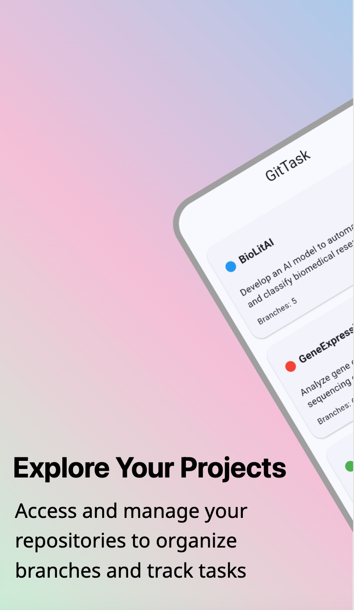
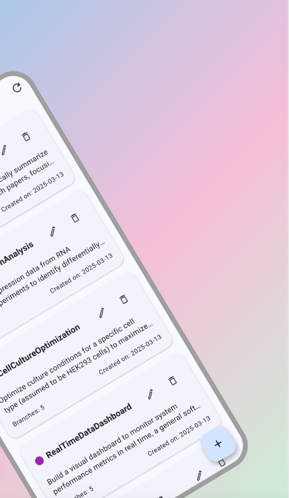
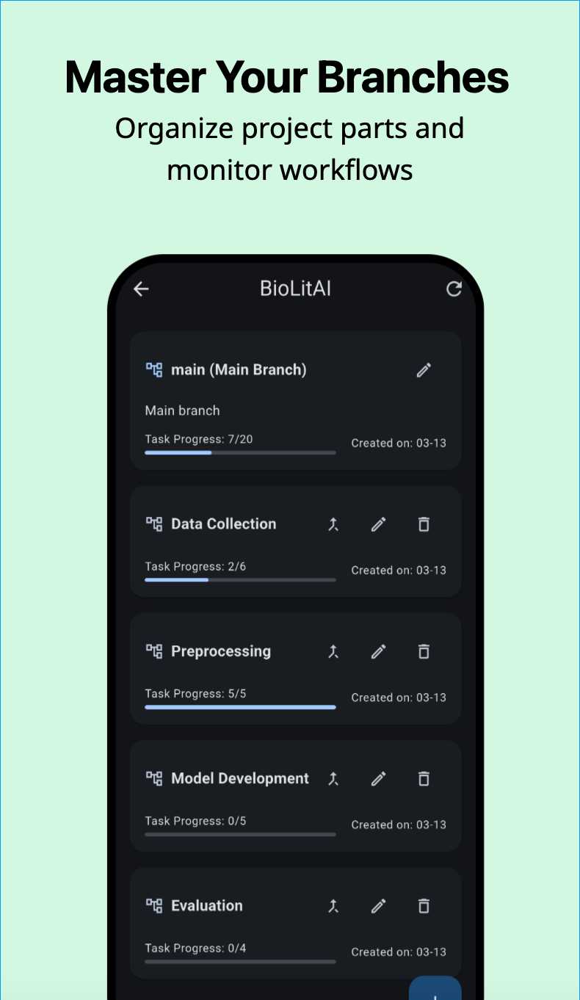
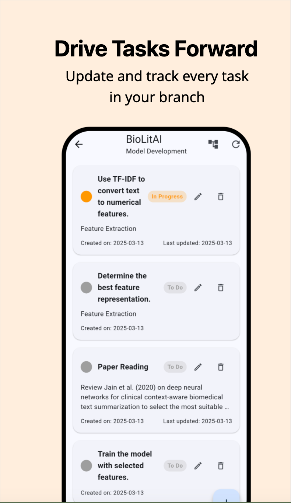
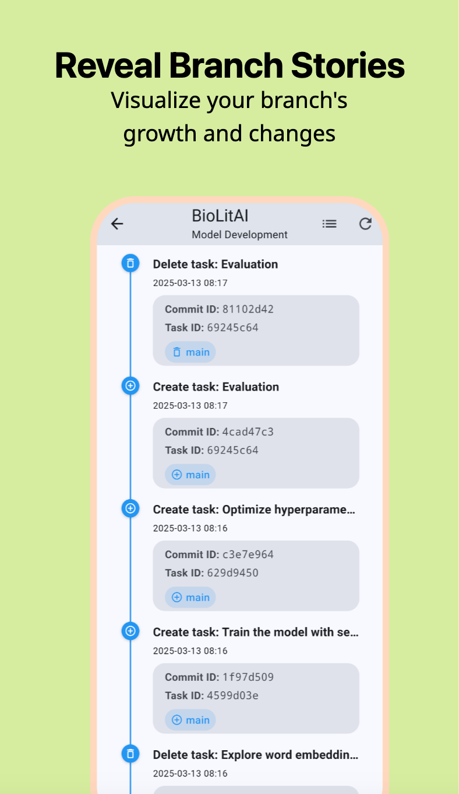
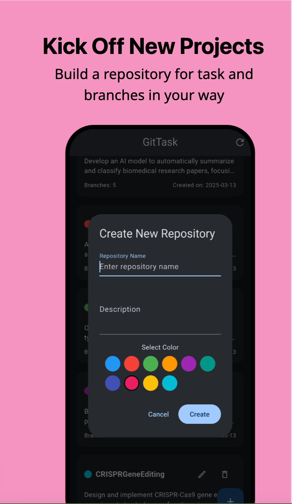
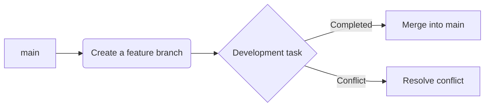

#  GitTask - Git-Inspired Task Manager

[](https://flutter.dev)
[](LICENSE)

GitTask integrates Git workflows into task management, enabling efficient task tracking and seamless team collaboration through branch management, commit histories, and repository concepts.

|  |  |  |
| --- | --- | --- |
|  |  |  |

## ✨ Key Features

### 🗃 Repository Management

- Create and delete project spaces modeled as code repositories
- Customize repository color tags
- Visualize and count branch statistics

### 🌿 Git-Style Workflow

- Create feature branches from the main branch
- Manage tasks independently across branches
- Visual merge conflict resolution
- Complete commit history tracking

### ✅ Task Management

- Three-stage task transitions (To Do/In Progress/Completed)
- Compare task details with previous versions
- Intelligent conflict detection and resolution suggestions
- Drag-and-drop task card status updates

### 📊 Data Visualization

- Live Git commit graphs
- Visualize branch merging relationships
- Task status distribution charts
- Project timeline tracking

## 🚀 Quick Start

### System Requirements

- Flutter 3.0+
- Dart 3.0+
- Android/iOS development environment

### Installation Steps

```bash
# Clone the repository
git clone https://github.com/Bengerthelorf/gittask.git

# Install dependencies
flutter pub get

# Run the project
flutter run
```

## 🛠 Technology Stack

### Core Framework

- **Flutter 3** – Cross-platform UI toolkit
- **Dart 3** – Null-safe programming language

### State Management

- Provider – Global state management

### Data Storage

- Hive – High-performance local database
- UUID – Unique identifier generation

### Visualization

- fl_chart – Chart drawing library
- Custom Git graph rendering

### Utility Libraries

- intl – Internationalization and formatting
- cupertino_icons – Icon resources

## 📖 User Guide

### Creating a New Repository

1. Click the ➕ button on the homepage.
2. Enter a repository name and description.
3. Choose a color tag.
4. Automatically generate a main branch.

### Branch Operations



### Task Management

- **Create Task:** Click ➕ on the branch page.
- **Status Change:** Drag-and-drop cards or click the status indicator.
- **Commit History:** Long-press a task to view its history.
- **Conflict Resolution:** Automatically detect and suggest fixes during merges.

## 🤝 Contributing

Contributions are welcome via Issues or Pull Requests. Please follow these steps:

1. Fork the repository.
2. Create a feature branch (`git checkout -b feature/awesome-feature`).
3. Commit your changes (`git commit -m 'Add some feature'`).
4. Push your branch (`git push origin feature/awesome-feature`).
5. Create a Pull Request.

## 📄 License

This project is licensed under the [GNU General Public License v3.0](LICENSE).
